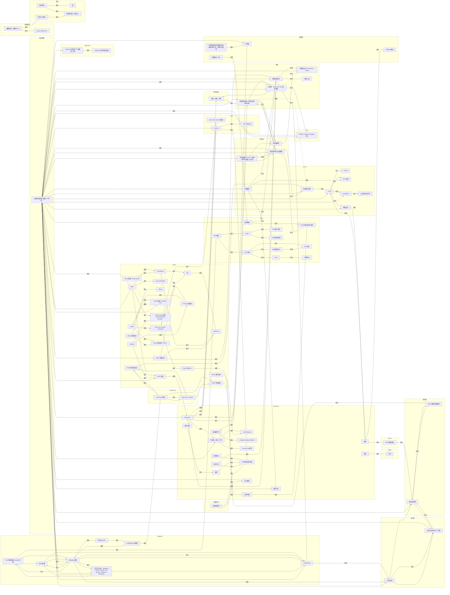

# 知识图谱

> 本文件由 `node scripts/kg.mjs build` 生成，请勿手改。关系维护在各文件的 frontmatter 里。

- 文件：107 篇
- 关联：154 对
- 已接入图谱：98 篇；孤立：9 篇
- 标签：24 个

## 关系图

只画有关联的节点（孤立节点见文末清单），按目录分组。`前置`/`深入` 有向，`相关`/`重叠` 无向。

## 按标签检索

### React（23）

[react-imvc 原理](React-imvc/原理.md) · [react-imvc vs Next.js](React-imvc/对比-Next.js.md) · [Class-VS-Function-component](React/Class-VS-Function-component.md) · [ConcurrentMode](React/ConcurrentMode.md) · [Diff](React/Diff.md) · [Fiber](React/Fiber.md) · [Hooks](React/Hooks.md) · [React key](React/key.md) · [React 原理：Hooks 与 HOC](React/react原理.md) · [Redux](React/Redux.md) · [React render 阶段（beforeMutation / mutation）](React/render.md) · [setState](React/setState.md) · [React 中的 this](React/this.md) · [VirtualDOM](React/VirtualDOM.md) · [React 事件机制](React/事件机制.md) · [React 单页路由](React/单页路由.md) · [React 原理：render 与 diff](React/原理.md) · [React 性能优化](React/性能优化.md) · [React 服务端渲染](React/服务端渲染.md) · [React 生命周期](React/生命周期.md) · [React 组件通信](React/组件通信.md) · [React 调度](React/调度.md) · [React 高阶组件（HOC）](React/高阶组件.md)

### JavaScript（21）

[Class 与 Function 的区别](ES6/Class-Function.md) · [Promise](ES6/Promise.md) · [ES6 方法汇总](ES6/方法汇总.md) · [call,bind,apply](Javascript/call,bind,apply.md) · [EventLoop](Javascript/EventLoop.md) · [for&forEach&forIn&forOf](Javascript/for&forEach&forIn&forOf.md) · [let,const,var区别](Javascript/let,const,var区别.md) · [事件代理](Javascript/事件代理.md) · [作用域、执行上下文](Javascript/作用域、执行上下文.md) · [数组扁平化](Javascript/数组扁平化.md) · [深浅拷贝](Javascript/深浅拷贝.md) · [手写源码实现合集](Javascript/源码实现.md) · [视区](Javascript/视区.md) · [继承](Javascript/继承.md) · [缓存对比](Javascript/缓存对比.md) · [表单](Javascript/表单.md) · [设计模式](Javascript/设计模式.md) · [跨域](Javascript/跨域.md) · [防抖节流](Javascript/防抖节流.md) · [面向对象](Javascript/面向对象.md) · [正则](Regex/正则.md)

### CSS（11）

[BFC](CSS/BFC.md) · [CSS3](CSS/CSS3.md) · [DOM 树是如何生成的](CSS/DOM.md) · [flex 布局](CSS/flex.md) · [CSS 画三角形](CSS/三角形.md) · [CSS 基础](CSS/基础.md) · [CSS 布局](CSS/布局.md) · [CSS 兼容性检测](CSS/检测兼容性.md) · [水平垂直居中](CSS/水平垂直居中.md) · [清除浮动](CSS/清除浮动.md) · [重排重绘](CSS/重排重绘.md)

### 工程化（11）

[Git](Git/Git.md) · [VSCode 使用与配置](Git/vscode.md) · [Babel 原理](webpack/babel原理.md) · [CSS 预处理器与 loader 原理](webpack/CSS预处理器与loader原理.md) · [imvc的webpack配置](webpack/imvc的webpack配置.md) · [TreeShaking](webpack/TreeShaking.md) · [Webpack 原理](webpack/webpack原理.md) · [打包工具对比（webpack / Rollup / esbuild / Vite / Rspack / Rolldown / Turbopack）](webpack/打包工具对比.md) · [项目webpack](webpack/项目webpack.md) · [JS 模块化](模块化/模块化.md) · [运行时动态执行 JS 代码](模块化/运行时动态执行代码.md)

### 面试题（9）

[baidu](面试题/baidu.md) · [h5与APP通信](面试题/h5与APP通信.md) · [头条](面试题/头条.md) · [小红书](面试题/小红书.md) · [批量插入 DOM](面试题/批量插入DOM.md) · [网易](面试题/网易.md) · [腾讯](面试题/腾讯.md) · [计时器](面试题/计时器.md) · [计算服务器的时间戳对应中国时区的今天、明天还是其他](面试题/计算服务器的时间戳对应中国时区的今天、明天还是其他.md)

### 网络（8）

[HTTP](HTTP/HTTP.md) · [HTTP2](HTTP/HTTP2.md) · [HTTP头部](HTTP/HTTP头部.md) · [TCP&UDP](HTTP/TCP&UDP.md) · [三次握手四次挥手](HTTP/三次握手四次挥手.md) · [前端缓存](HTTP/前端缓存.md) · [网络安全](HTTP/网络安全.md) · [页面渲染过程](HTTP/页面渲染过程.md)

### 构建（7）

[Babel 原理](webpack/babel原理.md) · [CSS 预处理器与 loader 原理](webpack/CSS预处理器与loader原理.md) · [imvc的webpack配置](webpack/imvc的webpack配置.md) · [TreeShaking](webpack/TreeShaking.md) · [Webpack 原理](webpack/webpack原理.md) · [打包工具对比（webpack / Rollup / esbuild / Vite / Rspack / Rolldown / Turbopack）](webpack/打包工具对比.md) · [项目webpack](webpack/项目webpack.md)

### 性能（5）

[性能指标与 Performance Timing](性能/性能时间.md) · [浏览器的进程、线程与事件循环全景](性能/浏览器.md) · [项目介绍](性能/项目介绍.md) · [项目性能优化](性能/项目性能优化.md) · [高并发：Node.js 与 Java 的两条路](性能/高并发.md)

### 浏览器（4）

[iframe跨端通信](iframe/iframe跨端通信.md) · [浏览器引擎与渲染原理](浏览器/浏览器.md) · [浏览器插件与 CDP：两种「操纵浏览器」的方式](浏览器/浏览器插件与CDP.md) · [浏览器调试](浏览器/浏览器调试.md)

### 算法（4）

[堆](算法/堆.md) · [算法题合集（左程云）](算法/左程云.md) · [排序算法](算法/排序.md) · [深度广度优先](算法/深度广度优先.md)

### ES6（3）

[Class 与 Function 的区别](ES6/Class-Function.md) · [Promise](ES6/Promise.md) · [ES6 方法汇总](ES6/方法汇总.md)

### 架构（3）

[SPA 与路由切换原理](微前端/SPA路由原理.md) · [微前端 原理](微前端/原理.md) · [高级前后端能力地图（AI 时代）](成长路线/高级前后端能力地图.md)

### Git（2）

[Git](Git/Git.md) · [VSCode 使用与配置](Git/vscode.md)

### 同构（2）

[react-imvc 原理](React-imvc/原理.md) · [react-imvc vs Next.js](React-imvc/对比-Next.js.md)

### TypeScript（2）

[TypeScript 类型守卫 / 抽象类 / 泛型](Typescript/index.md) · [TypeScript 常用语法速查](Typescript/InterfaceVStype.md)

### 微前端（2）

[SPA 与路由切换原理](微前端/SPA路由原理.md) · [微前端 原理](微前端/原理.md)

### 操作系统（2）

[Docker](操作系统/Docker.md) · [进程、线程、纤程](操作系统/纤程.md)

### 数据结构（2）

[ArrayList&LinkList](数据结构/ArrayList&LinkList.md) · [数据结构：前缀树 Trie](数据结构/数据结构.md)

### 模块化（2）

[JS 模块化](模块化/模块化.md) · [运行时动态执行 JS 代码](模块化/运行时动态执行代码.md)

### 正则（1）

[正则](Regex/正则.md)

### 后端（1）

[MySQL / Redis / MongoDB 对比](java/数据库.md)

### 成长路线（1）

[高级前后端能力地图（AI 时代）](成长路线/高级前后端能力地图.md)

### AI（1）

[高级前后端能力地图（AI 时代）](成长路线/高级前后端能力地图.md)

### 编程范式（1）

[函数式编程](编程范式/函数式编程.md)

## 内容重叠，待合并

- React 原理：Hooks 与 HOC（`React/react原理.md`） ⇄ React 原理：render 与 diff（`React/原理.md`）
- 页面渲染过程（`HTTP/页面渲染过程.md`） ⇄ 浏览器的进程、线程与事件循环全景（`性能/浏览器.md`）

## 待连接（还没有任何关联）

9 篇。每次挑几篇，在 frontmatter 里补 `related` / `prereq` / `deep`，再跑一次 build。

- **Git**：[Git](Git/Git.md)、[VSCode 使用与配置](Git/vscode.md)
- **Javascript**：[视区](Javascript/视区.md)
- **操作系统**：[Docker](操作系统/Docker.md)
- **面试题**：[baidu](面试题/baidu.md)、[头条](面试题/头条.md)、[小红书](面试题/小红书.md)、[网易](面试题/网易.md)、[腾讯](面试题/腾讯.md)
